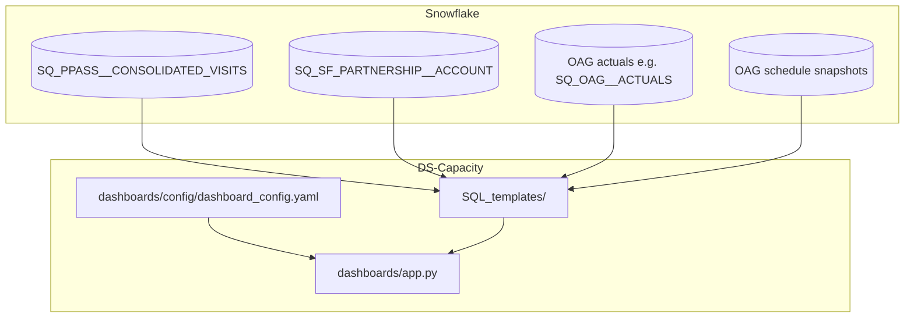

# Lounge(/Outlet) Capacity Management Analysis

This project is about understanding and analysing the capacity picture of a lounge (or outlet).

It contains python scripts to run a 1-off capacity analysis report and a Streamlit dashboard app prototype showing the retrospective capacity analysis results.


The Streamlit app that combines **Priority Pass visit intensity** (as lounge utilisation), **OAG departure actuals**, and **OAG scheduled seat snapshots** for the same airport as the selected outlet.

---

## Overview

The app is organised as **three main tabs**:

| Tab | What it shows |
|-----|----------------|
| **Utilisation** | 15-minute utilisation time series, distribution and peak charts by hour, weekday × hour heatmap (opening hours), raw utilisation table |
| **Departure flights** | Dual-axis chart: hourly **actual** departure flight counts (OAG actuals) vs **scheduled** seats by cabin (OAG schedule snapshots), with configurable rolling-hour seat total |
| **Combined view** | **Single dual-axis plot** for comparison: hourly **mean utilisation** (left axis) vs the same **scheduled seat** rolling series as the Departure flights tab (right axis), plus 70% / 100% utilisation reference lines |

**Utilisation** is defined as:

\[
\text{utilisation} = \frac{\text{estimated occupancy}}{\text{total seating capacity}}
\]

Estimated occupancy at each 15-minute slot is the **rolling sum of visits** over the preceding *N* slots, where *N* depends on **dwell time** (minutes in the sidebar). Capacity defaults from `NUMBER_OF_SEATS` in Snowflake for the selected outlet and can be overridden in the sidebar.

**Demo mode** (sidebar): replaces visit and flight **fact** data with synthetic series; **lounge metadata** (airport, terminal, opening hours, seat count seed) still loads from Snowflake so mappings stay realistic.

---

## Data flow



---

## Project structure

```
DS-Capacity/
├── README.md
├── requirements.txt
├── dashboards/
│   ├── app.py                    # Streamlit entry point
│   └── config/
│       └── dashboard_config.yaml # SQL paths, lounges, defaults, Snowflake hints
└── SQL_templates/
    ├── get_lounge_info.sql
    ├── visits/
    │   └── get_interval_visits_3months.sql
    └── flights/
        ├── counts_interval_historical_flights_selected_terminal_by_hour.sql
        └── counts_interval_schedule_flights_selected_terminal_by_hour.sql
```

---

## Data sources (high level)

| Use | Snowflake / source | Notes |
|-----|-------------------|--------|
| Visit counts (15-min) | `STAGING_QUALITY.PPASS.SQ_PPASS__CONSOLIDATED_VISITS` | Filtered by outlet and interval in `get_interval_visits_3months.sql` |
| Lounge metadata | `STAGING_QUALITY.SF_PARTNERSHIP.SQ_SF_PARTNERSHIP__ACCOUNT` | Codes, airport, terminal, seats, opening hours |
| Departure flights | OAG actuals (see historical flights SQL) | Terminal/airport scoped; chart fills a 15-min spine |
| Scheduled seats | OAG schedule snapshots (see schedule SQL) | Last-Monday-of-prior-month snapshot per month; cabin seat columns |

---

## Installation and run

### Prerequisites

- Python 3.10+
- Snowflake access (browser SSO via connector)
- Network / VPN as required by your account

### Install

From the **DS-Capacity** root:

```bash
pip install -r requirements.txt
```

### Environment

```bash
export SNOWFLAKE_USER="your.email@collinson.com"
export WAREHOUSE="YOUR_WAREHOUSE"
```

Account and database can also be set in `dashboards/config/dashboard_config.yaml` under `snowflake`.

### Configure outlets

Edit `dashboards/config/dashboard_config.yaml`:

- `target_lounge_codes` — outlets available in the app
- `defaults.*` — dwell time, lookback months, visit lag days, OAG `flight_service_type`
- `cabin_classes` — dropdown labels for scheduled-seat breakdown
- `upcoming_hour_for_flight_count` — default width (hours) for the rolling seat count / combined view

### Run Streamlit

From **DS-Capacity** root:

```bash
streamlit run dashboards/app.py
```

Open `http://localhost:8501`. First connection may open a browser for Snowflake SSO.

---

## Configuration reference — `dashboard_config.yaml`

| Key | Description |
|-----|-------------|
| `sql_templates.*` | Paths under `SQL_templates/` for lounge info, visits, historical flights, scheduled seats |
| `target_lounge_codes` | Lounge codes passed to `get_lounge_info` and visit query |
| `cabin_classes` | Labels for scheduled-seat series (mapped to `*_SEATS` columns in app) |
| `capacity_overrides` | Optional per-lounge seat overrides when SF value missing |
| `defaults.dwell_time_mins` | Default dwell time for occupancy rolling window |
| `defaults.lookback_months` | Default visit / flight window length |
| `defaults.visit_data_lag_days` | Days subtracted from “today” for visit end date (non-demo) |
| `defaults.flight_service_type` | OAG filter (e.g. `J` = scheduled passenger) |
| `upcoming_hour_for_flight_count` | Default rolling hours for scheduled seats (flights + combined tabs) |
| `snowflake.database`, `snowflake.account` | Connection parameters (user/warehouse often from env) |
| `query_tags` | Session parameters tag for Snowflake |

Brand colours under `visualization.colors` mirror Collinson palette used in charts.

---

## Sidebar controls

| Control | Description |
|---------|-------------|
| **Use demo data** | Synthetic visits & flights; metadata still from Snowflake |
| **Airport** | Derived from lounge rows; filters outlet list |
| **Outlet** | Selected lounge code for visits and capacity context |
| **Total seating capacity** | Editable; seeded from `NUMBER_OF_SEATS` when present |
| **Dwell time** | Minutes assumed per stay; drives occupancy rolling window |
| **Lookback period** | Months of history for visits (and flights when loaded) |
| **Opening hours** | Table from Snowflake; used to filter some utilisation summaries |

Tab-specific controls (Departure flights / Combined view): **cabin class**, **rolling hours** for scheduled-seat aggregation.

---

## Troubleshooting

| Issue | What to check |
|-------|----------------|
| Snowflake connection fails | VPN, `SNOWFLAKE_USER`, `WAREHOUSE`, `snowflake.account` / SSO |
| No visit data | Outlet has PP visits in range; `visit_data_lag_days` and lookback |
| No flight / schedule charts | Lounge has `AIRPORT_CODE`; templates and OAG data for that airport/terminal |
| Empty combined right axis | Scheduled-seat query returned empty or cabin column missing |
| Charts look flat in demo | Expected — synthetic data; turn off demo for production-shaped series |

---

## Related work

- [`plans/kpi_dashboard_plan.md`](../plans/kpi_dashboard_plan.md) — machine-readable implementation spec for AI agents
- [`metrics/kpi.py`](../metrics/kpi.py) — KPI computation functions
