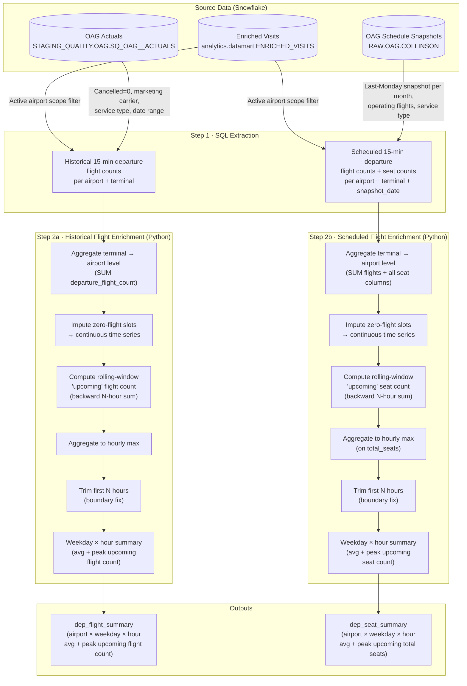

# Airport Traffic (Departure Flight Counts & Seat Counts): Computation Overview

## 1. Purpose

This document describes how the **airport departure traffic metrics** are computed, detailing the source data ingested, enrichment steps applied, the computation logic, and known limitations.

Airport traffic is summarised into two measures per airport, per hour:

| Metric | Description |
|---|---|
| **Upcoming departure flight count** | Number of distinct departing flights within a rolling N-hour window, derived from **historical actuals** |
| **Upcoming scheduled seat count** | Total seat capacity on departing flights within the same rolling window, derived from **published OAG schedule snapshots** |

These metrics serve as a proxy for the **demand pressure** that an airport's lounges are likely to face at a given hour.

---

## 2. Source Data

Two separate OAG datasets are extracted from Snowflake: one containing finalised historical actuals and one containing forward-looking published schedules.

### 2.1 Historical Actual Flights

**Source table:** `STAGING_QUALITY.OAG.SQ_OAG__ACTUALS`
**SQL template:** `DS-Capacity/SQL_templates/flights/extract_15min_interval_non-null_historical_flights.sql`
**Config:** `DS-Capacity/analysis/config/get_historical_flights.yaml`

| Field | Description |
|---|---|
| `FLIGHTID` | Unique flight identifier |
| `SCHEDDEPLOCAL` | Scheduled local departure time |
| `SCHEDDEPAPT` | Scheduled departure airport code |
| `ALTDEPAPT` | Actual departure airport code (used if non-empty, overrides scheduled) |
| `DEPTERMINAL` | Departure terminal |
| `SERVICETYPE` | OAG service type code (e.g. `J` = scheduled passenger) |
| `CANCELLED` | Cancellation flag (0 = not cancelled) |
| `OPAIRLINECODE` | Operating airline code (NULL = operated by marketing carrier) |

**Filters applied:**
- `CANCELLED = 0` — only non-cancelled flights
- `OPAIRLINECODE IS NULL` — marketing-carrier-operated flights only (excludes wet-leased/codeshare operations)
- `SERVICETYPE = '{flight_service_type}'` — typically `'J'` (scheduled passenger services)
- Date range: `SCHEDDEPLOCAL >= start_datetime AND < end_datetime`
- **Airport scope filter:** departure airport must appear in `analytics.datamart.ENRICHED_VISITS` within the same date window (i.e., airports where Collinson has active lounge visits)

**Aggregation:** Grouped into **15-minute time slots** by `airport_code + terminal + visit_slot`, outputting `COUNT(DISTINCT FLIGHTID)` as `departure_flight_count`.

---

### 2.2 Scheduled Flights and Seat Counts (OAG Snapshot)

**Source table:** `RAW.OAG.COLLINSON`
**SQL template:** `DS-Capacity/SQL_templates/flights/extract_15min_interval_non-null_scheduled_seats_and_flights.sql`
**Config:** `DS-Capacity/analysis/config/get_schedule_seat_count.yaml`

| Field | Description |
|---|---|
| `fltno` | Flight number |
| `depapt` / `depterm` | Departure airport and terminal |
| `flight_date` | Date of departure |
| `deptim` | Scheduled departure time (HHMM integer) |
| `file_date` | OAG snapshot publication date (used to select the correct snapshot) |
| `operating` | `'N'` = non-operating flight (excluded) |
| `service` | OAG service type code |
| `TOTAL_SEATS` | Total seat capacity on the flight |
| `FIRST_CLASS_SEATS` | First class seat count |
| `BUSINESS_CLASS_SEATS` | Business class seat count |
| `PREMIUM_ECONOMY_CLASS_SEATS` | Premium economy seat count |
| `ECONOMY_PLUS_CLASS_SEATS` | Economy plus seat count |
| `ECONOMY_CLASS_SEATS` | Economy class seat count |

**Snapshot selection logic:**

OAG publishes schedule snapshots at regular intervals. Rather than using any arbitrary snapshot, the query selects — for each calendar month in the lookback window — the snapshot published on the **last Monday of the previous calendar month**. This represents the best-known schedule just before the month begins.

```
Example (end_datetime = 2026-05-08, lookback = 3 months):
  May-2026  →  snapshot = last Monday of Apr-2026 (2026-04-27)
  Apr-2026  →  snapshot = last Monday of Mar-2026 (2026-03-30)
  Mar-2026  →  snapshot = last Monday of Feb-2026 (2026-02-23)
  Feb-2026  →  snapshot = last Monday of Jan-2026 (2026-01-26)
```

Each flight is matched to its calendar month via the `month_periods` CTE, and only included if its `file_date` matches the designated `snapshot_date` for that month.

A **synthetic `flight_key_id`** is constructed as the concatenation of `fltno + depapt + depterm + flight_date + deptim` to deduplicate flights across the snapshot.

**Filters applied:**
- `operating <> 'N'` — operating flights only
- `service = '{flight_service_type}'` — typically `'J'`
- Same airport scope filter via `analytics.datamart.ENRICHED_VISITS`

**Aggregation:** Grouped into **15-minute time slots** by `airport_code + terminal + visit_slot + snapshot_date`, outputting `COUNT(DISTINCT flight_key_id)` as `departure_flight_count` plus `SUM()` of all seat columns.

---

## 3. Data Flow Diagram



---

## 4. Computation Steps in Detail

### Step 1 — SQL Extraction

Both queries extract non-cancelled, operating-carrier departure flights within the date range, scoped to airports with active Collinson lounge visits. Time is sliced into **15-minute buckets** (`TIME_SLICE(..., 15, 'MINUTE')`).

The scheduled query additionally joins a `month_periods` CTE to enforce the **correct OAG snapshot** per calendar month, ensuring reproducibility and consistency in what "scheduled capacity" means.

### Step 2 — Aggregate to Airport Level

Both datasets are extracted at **terminal level** from SQL. In Python, the terminal dimension is collapsed to **airport level** by grouping on `(visit_slot, airport_code)` and summing `departure_flight_count` (and seat columns for scheduled data).

> **Note:** A TODO in the codebase flags that terminal-level aggregation is not yet implemented; all analysis is currently at the airport level only.

### Step 3 — Impute Zero-Flight Slots (`impute_zero_flights`)

As with visit data, the raw flight extracts are sparse. This step reindexes each airport's time series to a **complete 15-minute grid** from midnight on the first day to 23:45 on the last day, filling gaps with `departure_flight_count = 0` (and seat columns to `0` for scheduled data).

### Step 4 — Compute Rolling "Upcoming" Traffic (`compute_upcoming_air_traffic_from_flights`)

A **backward-looking rolling sum** is applied over a window of `N_hours × 4` slots (e.g. 3 hours × 4 = 12 slots at 15-min granularity):

```
windows = (relevant_upcoming_hours × 60) ÷ flight_interval   (e.g. 3 × 60 ÷ 15 = 12)

upcoming_flight_count[t] = Σ departure_flight_count[t - 11 : t]
upcoming_total_seats[t]  = Σ total_seats[t - 11 : t]
```

The same rolling logic is applied to all seat-class columns for scheduled data.

The `relevant_upcoming_hours` parameter is set to **3 hours** in the pipeline config.

### Step 5 — Aggregate to Hourly Max (`get_hourly_max`)

The 15-minute rolling traffic series is reduced to an **hourly series** by taking the **maximum** value within each clock hour. This represents the peak traffic pressure observed within that hour.

### Step 6 — Boundary Trim

The first `relevant_upcoming_hours` rows (i.e. first 3 hours) of the hourly series are discarded, as the rolling window at the start of the extraction period has insufficient lookback data and will underestimate traffic.

### Step 7 — Weekday × Hour Summary (`compute_weekday_and_hour_summary`)

Hourly traffic values are grouped by `(day_of_week, hour)` and two statistics are computed across all equivalent weekday-hours in the analysis period:

| Column | Description |
|---|---|
| `avg_upcoming_flight_count` | Mean historical flight count across same weekday-hours |
| `peak_upcoming_flight_count` | Maximum historical flight count across same weekday-hours |
| `avg_total_seats` | Mean scheduled seat count across same weekday-hours |
| `peak_total_seats` | Maximum scheduled seat count across same weekday-hours |

---

## 5. Enriched Data Schema

### `dep_flight_summary` (historical, weekday × hour aggregation)

| Column | Type | Description |
|---|---|---|
| `airport_code` | str | IATA airport code |
| `weekday` | str | e.g. `Mon`, `Tue`, … |
| `hour` | str | e.g. `08:00`, `14:00`, … |
| `avg_upcoming_flight_count` | float | Average N-hour rolling flight count for this weekday-hour |
| `peak_upcoming_flight_count` | float | Peak N-hour rolling flight count for this weekday-hour |

### `dep_seat_summary` (scheduled, weekday × hour aggregation)

| Column | Type | Description |
|---|---|---|
| `airport_code` | str | IATA airport code |
| `weekday` | str | e.g. `Mon`, `Tue`, … |
| `hour` | str | e.g. `08:00`, `14:00`, … |
| `avg_total_seats` | float | Average N-hour rolling seat count for this weekday-hour |
| `peak_total_seats` | float | Peak N-hour rolling seat count for this weekday-hour |

Individual seat-class breakdowns (`first_class_seats`, `business_class_seats`, `premium_economy_seats`, `economy_plus_seats`, `economy_class_seats`) are carried through the rolling aggregation but are not currently included in the weekday-hour summary output.

---

## 6. Key Configuration Parameters

| Parameter | Source config | Description |
|---|---|---|
| `flight_service_type` | `get_historical_flights.yaml`, `get_schedule_seat_count.yaml` | OAG service type filter (default: `'J'` = scheduled passenger) |
| `relevant_upcoming_hours` | `compute_utilisation_and_airport_traffic.yaml` | Rolling window width in hours (default: `3`) |
| `flight_interval` | hardcoded (`compute.py`) | Granularity of flight data in minutes (15) |
| `start_datetime` / `end_datetime` | respective config files | Date window for SQL extraction |

---

## 7. Potential Limitations

### L1 — "Upcoming" Window is Backward-Looking
Despite being named `compute_upcoming_air_traffic_from_flights` and described as forward-looking demand, the implementation uses pandas' default **backward-looking** `.rolling()` sum. At time `T`, the metric sums flights from `T-2h45m` to `T` — i.e. recent departures, not future departures. This is a naming/intent mismatch. If the goal is to capture upcoming demand pressure on lounges, a forward-looking rolling window (shift the series before summing) would be more appropriate.

### L2 — Boundary Underestimation at Series Start
The backward rolling window has no data before `start_datetime`, so the first `relevant_upcoming_hours` (3) hours of the series systematically undercount traffic. The current hotfix drops these rows, but this may silently remove valid early-morning data for the first day of the extraction window.

### L3 — Terminal-Level Data Collapsed to Airport Level
Both SQL queries extract flight data at terminal granularity, but Python aggregates everything to the **airport level**. Lounges within different terminals at the same airport can face very different traffic volumes. A TODO in the code acknowledges this limitation but it has not yet been addressed.

### L4 — Historical Actuals vs. Scheduled Data Misalignment
The historical dataset reflects **what actually flew** (post-hoc), while the scheduled dataset reflects **what was planned** before each month began. Merging or comparing these two series must account for the fact that scheduled flights may be cancelled, delayed, or added ad-hoc. There is currently no reconciliation step between the two datasets.

### L5 — OAG Snapshot Selection Assumes Monthly Granularity
The scheduled query assigns one snapshot date per calendar month. If OAG substantially revises schedules mid-month, those revisions will not be captured. The last-Monday-of-previous-month convention also means very late schedule changes (in the final week of a month) may not be reflected.

### L6 — Airport Scope Tied to Visit Data Availability
Only airports that appear in `analytics.datamart.ENRICHED_VISITS` within the extraction window are included. Airports where Collinson has lounges but no visit records (e.g. newly onboarded or data-incomplete outlets) will be silently excluded from the flight traffic data.

### L7 — `ENRICHED_VISITS` Pre-2023 Data Gap
The enriched visits table only holds visit data from May 2023 onwards, as noted in the SQL comments. Using a date window that extends before May 2023 for airport scope filtering may yield an incomplete or incorrect airport list for earlier periods.

### L8 — Marketing Carrier Filter (`OPAIRLINECODE IS NULL`)
The historical actuals query excludes flights where `OPAIRLINECODE IS NOT NULL`. This removes codeshare/wet-lease operations where a different airline operates the flight. Depending on how OAG encodes this, some legitimate scheduled passenger services may be excluded, underestimating total departures at certain airports.

### L9 — Seat Count Availability Only in Scheduled Data
Seat-class breakdowns are available only from the scheduled OAG snapshots (`RAW.OAG.COLLINSON`). The historical actuals table (`SQ_OAG__ACTUALS`) does not include seat counts, so no actual-versus-scheduled seat capacity comparison is possible.

### L10 — Hourly Max May Inflate Peak Estimates
Using the maximum of the 15-minute values within each clock hour amplifies the impact of short-lived traffic spikes. A flight cluster concentrated in a single 15-minute slot will register the same hourly value as one spread evenly across four slots, potentially overstating sustained pressure.
