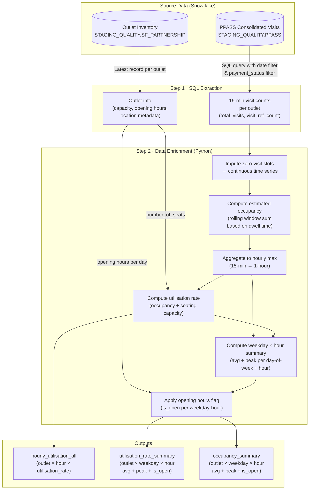

# Outlet Utilisation Rate: Computation Overview

## 1. Purpose

This document describes how the **outlet utilisation rate** is computed, detailing the source data ingested, enrichment steps applied, the computation logic, and known limitations.

The utilisation rate measures how occupied an airport lounge outlet is relative to its seating capacity at any given hour, expressed as a ratio:

```
Utilisation Rate = Estimated Occupancy / Seating Capacity
```

---

## 2. Source Data

Two datasets are extracted from Snowflake and joined during analysis.

### 2.1 Visit Data — 15-Min Interval Counts

**Source table:** `STAGING_QUALITY.PPASS.SQ_PPASS__CONSOLIDATED_VISITS`
**SQL template:** `DS-Capacity/SQL_templates/visits/extract_15min_interval_non-null_visits.sql`

| Field | Description |
|---|---|
| `VISIT_ID` | Unique booking/group visit identifier |
| `OUTLET_ID` | Outlet code (normalised to uppercase) |
| `EXPERIENCE_DATE` | Timestamp of visit start |
| `MEMBER_COUNT` | Number of members on the booking |
| `GUEST_COUNT` | Number of guests on the booking |

**Filters applied:**
- Date range: `EXPERIENCE_DATE >= start_datetime` AND `< end_datetime`
- Payment status: records after 2023-06-01 must have `payment_status <> 'NA'`

**Aggregation:** Records are grouped into **15-minute time slots** (`TIME_SLICE(..., 15, 'MINUTE')`), summing `MEMBER_COUNT + GUEST_COUNT` as `total_visits` and counting distinct `VISIT_ID` as `visit_ref_count`.

---

### 2.2 Outlet Inventory / Lounge Info

**Source table:** `STAGING_QUALITY.SF_PARTNERSHIP.SQ_SF_PARTNERSHIP__ACCOUNT`
**SQL template:** `DS-Capacity/SQL_templates/inventory/get_all_lounge_info.sql`

| Field | Description |
|---|---|
| `OUTLET_CODE` | Unique outlet identifier |
| `OUTLET_NAME` | Human-readable name |
| `AIRPORT_CODE` | IATA airport code |
| `NUMBER_OF_SEATS` | Declared seating capacity (used as denominator) |
| `TERMINAL` / `CONCOURSE` | Physical location within airport |
| `ACCOUNT_STATUS` | Active/inactive status |
| `OUTLET_TYPE` | Inventory category (e.g. lounge, restaurant) |
| `ISO_COUNTRY_CODE` | Country of operation |
| `AIRSIDE_LANDSIDE` | Whether airside or landside |
| `OPERATOR_CODE` | Lounge operator identifier |
| `{DAY}_OPEN_TIME` / `{DAY}_CLOSE_TIME` | Opening hours per day of week (Mon–Sun) |
| `LAST_MODIFIED_DATE` | Used to deduplicate to the latest record per outlet |

---

## 3. Data Flow Diagram



---

## 4. Computation Steps in Detail

### Step 1 — SQL Extraction

The SQL query extracts visit events within a specified date window, deduplicates by `VISIT_ID`, and slices time into 15-minute buckets. Visitor count per slot is `MEMBER_COUNT + GUEST_COUNT` (i.e., the entire booking group counts as simultaneous arrivals).

### Step 2 — Impute Zero-Visit Slots (`impute_zero_visits`)

The extracted visit data is sparse — only slots with at least one visit are present. This step reindexes each outlet's time series to a **complete, continuous grid** from midnight on the first visit day to 23:45 on the last, filling all gaps with `total_visits = 0`.

### Step 3 — Estimate Occupancy via Rolling Window (`compute_occupancy_from_visit`)

Since the visit data records **arrival times** only (no departure time), occupancy is estimated using a **backward-looking rolling sum**:

```
windows = dwell_time_minutes ÷ visit_interval   (e.g. 60 ÷ 15 = 4 windows)

estimate_occupancy[t] = Σ total_visits[t - (windows-1) : t]
```

The assumption is that all visitors who arrived within the last `dwell_time` minutes are still present at time `t`. The `dwell_time` is a fixed global parameter set in the pipeline config.

### Step 4 — Aggregate to Hourly Max (`get_hourly_max`)

The 15-minute occupancy series is reduced to an **hourly series** by taking the **maximum occupancy** observed within each clock hour. This represents the peak pressure on the outlet in that hour.

### Step 5 — Compute Utilisation Rate (`compute_utilisation_rate`)

```
utilisation_rate[t] = estimate_occupancy[t] / number_of_seats
```

Outlets with `number_of_seats = 0` or `NULL` are **skipped** and logged separately.

### Step 6 — Weekday × Hour Summary (`compute_weekday_and_hour_summary`)

Hourly utilisation rates (or occupancy figures) are grouped by `(day_of_week, hour)` and two statistics are computed across all weeks in the analysis period:

| Column | Description |
|---|---|
| `avg_utilisation_rate` | Mean across all same weekday-hours in the period |
| `peak_utilisation_rate` | Maximum observed across all same weekday-hours |

### Step 7 — Opening Hours Flag (`get_weekday_hour_is_open_flag`)

For each `(weekday, hour)` cell in the summary, an `is_open` boolean flag is derived from the outlet's declared opening and closing times. This allows downstream consumers to filter out or visually distinguish closed hours from legitimately low-utilisation periods.

---

## 5. Enriched Data Schema

### `hourly_utilisation_all` (per-hour granularity)

| Column | Type | Description |
|---|---|---|
| `outlet_code` | str | Outlet identifier |
| `visit_hour` | datetime | Floored to the hour |
| `estimate_occupancy` | int | Estimated number of people present |
| `utilisation_rate` | float | `estimate_occupancy / number_of_seats` |

### `utilisation_rate_summary` (weekday × hour aggregation)

| Column | Type | Description |
|---|---|---|
| `outlet_code` | str | Outlet identifier |
| `weekday` | str | e.g. `Mon`, `Tue`, … |
| `hour` | str | e.g. `09:00`, `14:00`, … |
| `avg_utilisation_rate` | float | Average utilisation for this weekday-hour |
| `peak_utilisation_rate` | float | Peak utilisation for this weekday-hour |
| `is_open` | bool | Whether the outlet is open at this weekday-hour |

### `occupancy_summary` (weekday × hour aggregation)

Same structure as above but with `avg_estimate_occupancy` and `peak_estimate_occupancy` instead of utilisation columns. Useful for outlets with missing capacity data.

---

## 6. Key Configuration Parameters

| Parameter | Description |
|---|---|
| `dwell_time` | Assumed fixed visitor dwell time (minutes). Drives the rolling window width. |
| `visit_interval` | Granularity of visit data (default: 15 minutes) |
| `start_datetime` / `end_datetime` | Date window for SQL extraction |
| `relevant_upcoming_hours` | Lookback window for airport traffic analysis (Part II) |

---

## 7. Potential Limitations

### L1 — Fixed Dwell Time Assumption
Occupancy is estimated using a **single global dwell time** value applied uniformly to all outlets, weekdays, and hours. In reality, dwell times vary by outlet type, time of day, and individual visitor behaviour. An overestimated dwell time inflates occupancy; an underestimated one deflates it.

### L2 — Arrival-Only Visit Data
The system has **no departure timestamps**. It cannot observe when visitors actually leave, so occupancy is always an estimate derived from arrivals and an assumed dwell time. Actual occupancy at any moment may differ significantly.

### L3 — Rolling Window Boundary Underestimation
At the **start of the extraction period**, the rolling window has no prior data to look back on, so occupancy will be underestimated for the first `dwell_time` minutes of the series. In the airport traffic module this is handled by trimming the first `N` hours; the same issue exists for visit occupancy but has no equivalent trim applied.

### L4 — Missing or Zero Seating Capacity
Outlets with `NUMBER_OF_SEATS = 0` or `NULL` are **silently excluded** from the utilisation rate output. The proportion of such outlets is logged but not corrected. Stale or inaccurate capacity data in the inventory will produce misleading utilisation figures.

### L5 — Payment Status Filter Gap
The filter `payment_status <> 'NA'` only applies to records **after 2023-06-01**. Records before this date are included regardless of payment status, which may include cancelled, invalid, or test bookings, potentially inflating historical visit counts.

### L6 — Outlet Code Case Inconsistency
Outlet codes in the visits table are not consistently cased. The SQL applies `UPPER(OUTLET_ID)` as an ad-hoc fix, suggesting an upstream data quality issue that could silently split visit records from the same outlet if the fix is ever removed or not consistently applied.

### L7 — Opening Hours Default Fallback
If an outlet has no opening hours recorded (`—`), the system defaults to treating it as **open 00:00–24:00**. This means the `is_open` flag will incorrectly mark all hours as open for outlets with missing schedule data, masking potential data quality issues.

### L8 — Hourly Max vs Mean Aggregation
Using the **maximum** of the four 15-minute occupancy readings within each hour gives a conservative (high) estimate of peak pressure, but the mean across weekday-hours may over-represent transient spikes rather than sustained occupancy. The choice of max vs mean is not configurable.

### L9 — Group Bookings Counted as Simultaneous Arrivals
`total_visits = MEMBER_COUNT + GUEST_COUNT` treats all individuals in a booking as arriving at exactly the same moment. If group members arrive at different times, this will create artificial spikes in 15-minute slot counts that overestimate true concurrent occupancy.

### L10 — No Terminal-Level Granularity
Outlet data includes terminal information, but the current pipeline does not segment utilisation by terminal. Airport-level flight data aggregation also has a noted TODO for terminal-level breakdown, meaning comparisons between outlets in different terminals of the same airport are not adjusted for terminal-specific traffic patterns.
